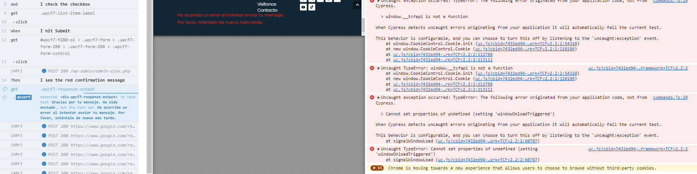
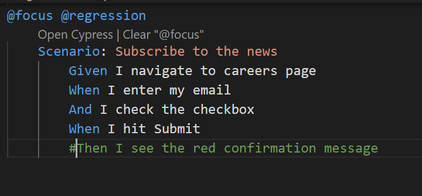

# Automación de Contact us page
## Por qué Cypress
Elegí Cypress porque es una opción óptima para garantizar una automatización de pruebas rápida, confiable y escalable en aplicaciones web modernas.

## Page Objects Model
El modelo de objetos de página (POM) es un patrón de diseño en la automatización de pruebas que separa la lógica de prueba de la interfaz de usuario de la aplicación. Yo elegí POM porque si la interfaz de usuario cambia (por ejemplo, se cambia el nombre o se mueve un botón), solo necesito actualizar el archivo PO, no todos los scripts de prueba. Esto reduce el esfuerzo necesario para mantener las pruebas.

## Cucumber BDD (Behavior-Driven Development)
Elegí usar Cucumber porque eso permite escribir pruebas en un lenguaje que tanto los desarrolladores, evaluadores y partes interesadas comerciales puedan entender. Esto hace que sea más fácil para los miembros del equipo no técnicos contribuir a la creación de casos de prueba, lo que garantiza que las pruebas reflejen con precisión los requisitos comerciales.

### Error en el JS de la pagina
1. Cuando Cypress  navegó al sitio web de Embention, la prueba Cypress falló, porque hay un error de JS en la página de Embention. Puede verificar en devtools el error: Uncaught SyntaxError: Unexpected end of input.
Aunque esto puede no ser crítico, puede generar un comportamiento inesperado, funcionalidades defectuosas o incluso que partes de la página web no se carguen correctamente. Esto necesita ser arreglado
Entonces, para superar este error y lograr que las pruebas de Cypress pasen, agregué lo siguiente en mi command.js

```csharp
Cypress.on('uncaught:exception', (err, runnable) => {
  // Optional: Log the error
  console.error('Uncaught exception:', err);

  // Prevent Cypress from failing the test
  return false;
});
```

 2.  Hay otro error de JavaScript dentro de esa página.  Cuando Cypress ingresa  un correo electrónico, la página web muestra un error:
 
 Pero cuando escribo el mismo correo electrónico manualmente, recibo un mensaje de confirmación de éxito:


Debido a esto error dentro de la aplicación, yo tuve que comentar la última line del archivo:  embentionCareersPage\cypress\integration\examples\features\careers.feature donde se realiza la verificación del mensaje de confirmación
