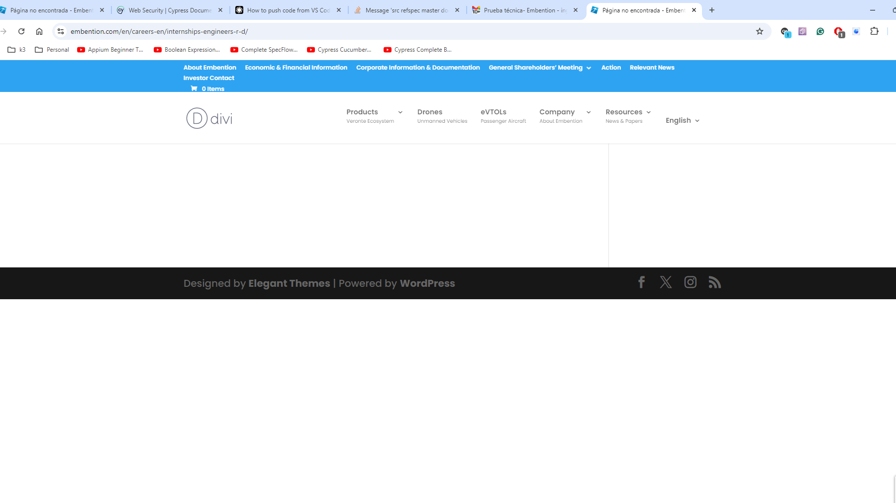
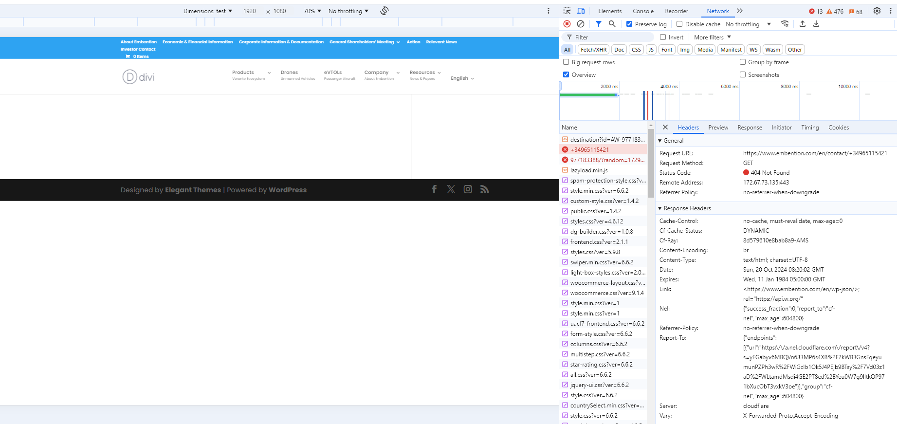
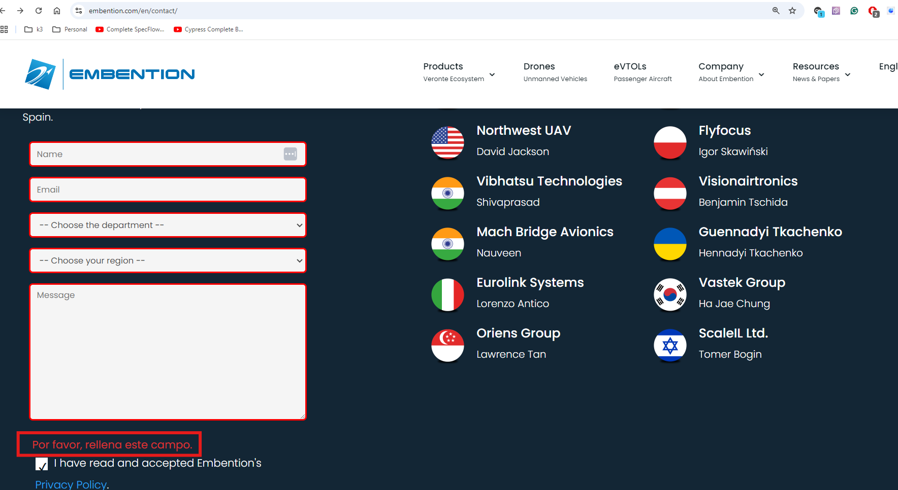
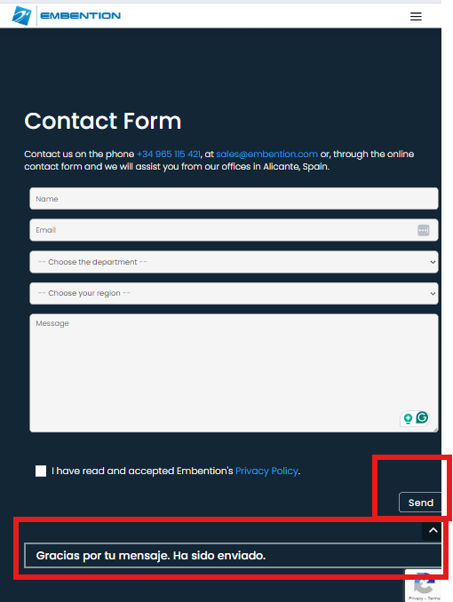
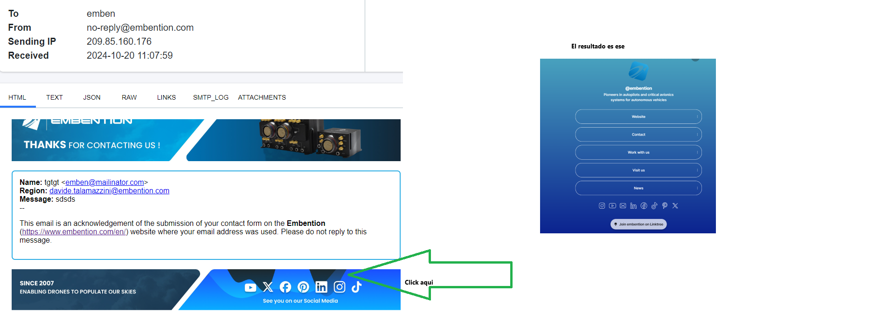

# Issue Report

### Issue#1

Al hacer click en el enlace enviado (https://www.embention.com/en/careers-en/internships-engineers-r-d/), encontré los siguientes problemas:

1. Visualización incorrecta: la barra de WordPress, que debería aparecer en la parte inferior de la página, se muestra en el medio de la página.
2. Error en el título de la página: el título de la página muestra "Página no encontrada" en lugar del título de página esperado.

A pesar de los errores, es posible navegar a la página de ``contact us''.
A continuación, enumero los errores encontrados en la página de contacto.

### Issue#2
**Título:** La barra de menú carga después de otros elementos.

**Descripción:** La barra de menú carga un poco después de todos los elementos. Se puede notar un breve retraso, especialmente para usuarios con conexiones o dispositivos más lentos.
**Pasos para reproducción:**
1. Navegue a la página "Contact us".
2. Observe la secuencia de carga de los elementos.

**Resultado esperado:** Todos los elementos, incluida la barra de menú, deben cargarse simultáneamente para garantizar una experiencia de usuario perfecta.

**Resultado real:** La barra de menú se carga al final, lo que retrasa la navegación.

**Gravedad:**  Baja

**Impacto:** Los usuarios pueden experimentar retrasos en el acceso a las opciones de navegación, lo que podría generar frustración.

**Acción recomendada:** Investigar la secuencia de carga y optimizar la página para garantizar que la barra de menú se cargue simultáneamente con otros elementos.

### Issue#3
**Título:**: El enlace del número de teléfono no funciona como debería y me envía a una página 404.

**Descripción:** Al hacer click en el enlace del número de teléfono, me envía a una página 404 (https://www.embention.com/en/contact/+34965115421) en lugar de iniciar una llamada.

**Pasos para reproducción:**
1. Navegar a la página de contacto (https://www.embention.com/en/contact/)
2. Haga click en el número de teléfono

**Resultado esperado:** Al hacer click en el enlace del número de teléfono, es posible que se abra una aplicación de llamadas si hay una instalada (como Skype) o se le solicite al usuario que elija un método de llamada.

**Resultado real:** Al hacer click en el enlace del número de teléfono, me devuelve a una página 404.
Foto adjunta:

**Gravedad:**  Alta

### Issue#4
**Título:** El enlace del email no funciona como debería y me envía a una página con error 404.

**Descripción:** Al hacer click en el enlace de correo electrónico, me envía a una página con error 404: https://www.embention.com/en/contact/%3Ca%20href=%22mailto:sales@embention.com%22%3E%3C/a%3E.

**Pasos para reproducción:**
1. Navegar a la página de contacto (https://www.embention.com/en/contact/).
2. Haga click en el número de teléfono.

**Resultado esperado:** Al hacer click en un enlace de correo electrónico, debería permitir a los usuarios abrir su cliente de correo electrónico predeterminado con un nuevo mensaje dirigido a la dirección de correo electrónico especificada.

**Resultado real:** Al hacer click en el enlace del correo electrónico, la página retorna error 404.

**Gravedad:**  Alta

### Issue#5
**Título:**: Inconsistencia de lenguaje en el mensaje de alerta

**Descripción:** Al utilizar el formulario de contacto en la versión en inglés de la página, el mensaje de alerta que se muestra está en español. Esto genera confusión en los usuarios que esperan que todo el contenido esté en inglés.

**Pasos para reproducción:**
1. Navegar a la página de contacto (https://www.embention.com/en/contact/)
2. No rellene los campos y haga click en el checkbox.

**Resultado esperado:** Al hacer click en un enlace de correo electrónico, debería permitir a los usuarios abrir su cliente de correo electrónico predeterminado con un nuevo mensaje dirigido a la dirección de correo electrónico especificada.

**Resultado real:** Al hacer click en el enlace del correo electrónico, la página retorna error 404.
Foto adjunta:

**Gravedad:**  Alta

### Informe de mejora:
**Mejora 1**
1. **Título:** Ubicación del mensaje de éxito después del envío del formulario.
2. **Descripción:** Después de enviar el formulario de contacto, el mensaje de confirmación aparece muy por debajo del formulario, lo que obliga a los usuarios a desplazarse hacia abajo para verlo. Esto puede generar confusión y dar la impresión de que el envío del formulario no se realizó correctamente.
3. **Acción recomendada:** considere reposicionar el mensaje de éxito para garantizar que sea visible inmediatamente después del envío, o usar un modal/diálogo que se superponga al formulario para una mejor visibilidad.

**Mejora 2**
1. **Título:** Botón y mensaje de confirmación truncados al acceder desde Tablet.
2. **Acción recomendada:** Ajuste el diseño o el estilo específicamente para la vista de tableta para garantizar que todos los elementos, incluido el botón y el mensaje de confirmación, sean completamente visibles.
Implemente técnicas de diseño adaptativo para adaptar la pantalla a distintos tamaños de pantalla de tableta.
Foto adjunta:

**Mejora 3**
1. **Título:** Íconos de redes sociales abren Linktree en vez de los enlaces directos da cada red social.
2. **Acción recomendada:** : En el e-mail recibido desde el formulario de contacto, todos los íconos de redes sociales abren la página LinkTree. Esto puede causar confusión en los usuarios, ya que lo esperado es que cada ícono de red social abra directamente la red social esperada.
Foto adjunta:

